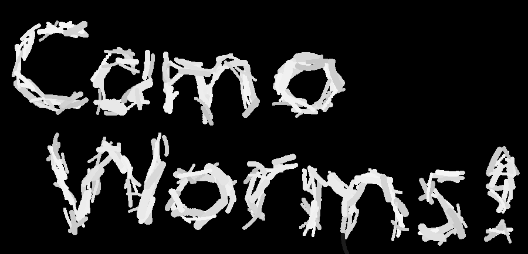
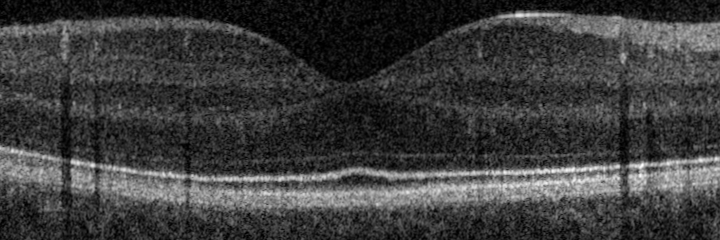

# 🐛 Camo Worms
Welcome to,

 !


CamoWorms is a project that evolves camouflage worms to replicate images. This aims to highlight the major trends in images. The available algorithms are specifically tuned for reducing visual noise in Optical Coherence Tomography (OCT) images.

This project was created as part of a group project for the CITS4404 unit at UWA in semester 1 of 2022. The original project brief for the project can be found in [`./docs/practical-project.pdf`](./docs/practical-project.pdf).

## Example Worms
**Input OCT Image**



**Output Camo Worms Image**


## Running

This project can be run natively or inside docker for improved compatibility.
A jupyter notebook is also available.

### In Docker

The project can be run in docker to improve compatibility and ease of deployment in cloud environments.
The docker start script is currently setup to run the swarm algorithm.

The docker run script maps the progress frames generated into `./progress/<unix epoch at start>/`.
**Note** that these files and folders will be owned by **root**.
Ownership can be easily updated using `chown`.

#### Requirements

- Docker
    - Known working on version `20.10.16`
- Unix based system
    - For the run scripts

#### Steps

Before the following steps `opencv` must be removed from `requirements.txt`.

```bash
# Update script permissions to be runnable
chmod +x ./bin/*

# Build the docker image
# This needs to be rebuilt after every code change
./bin/build

# Start a container based on the created image
# The number of generations can be controlled and defaults to 10
./bin/start <number of generations> <overlap decay rate>
```

### Natively

#### Requirements

- Python `3.10+`
- Assumes `python` in in `PATH`

#### Steps

```bash
# Install the required python packages
pip install -r requirements.txt

# Greedy Algo
python main.py greedy ./images/inputs/original-cropped.png ./progress 50 50

# Swarm Algo
python main.py swarm ./images/inputs/original-cropped.png ./progress 50 0.9
```

### Notebook

A jupyter notebook ([`CamoWorms.ipynb`](./CamoWorms.ipynb)) is also provided that includes demos of mask generation, worm manipulation, and the greedy algorithm.
